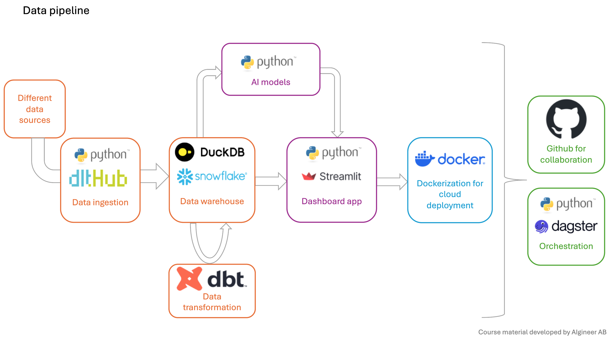

# Introduction

This course is a continuation of a previous course in python. Students taking this course should have kompetence on python fundamental, data processing in pandas, data visualisation in matplotlib, seaborn and plotly express. 

Through out the course, we will be learning different components of a modern data stack. The data pipeline below showcases the tools that we will be learning. These tools are chosen to match current industry's need. 

## Read more 
  