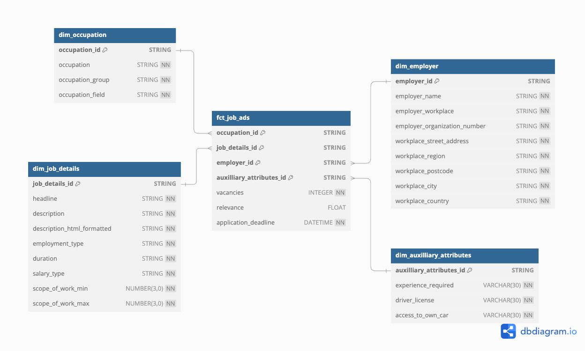

# Data transformation with dbt - a more realistic example 🔍📖

## Introduction 📚
Video on dbt theory to transform data :point_down:
TO BE UPDATED

## Data modeling ⭐
In practice, the tables in the staging layer usually match the raw source data, but in the refined layer, we reorganize them into a new structure, like a **dimensional model**. A dimensional model is a way of organizing data into **facts** (numbers to measure, like sales or revenue) and **dimensions** (categories to filter or group by, like products, time, or locations) to make analysis easier. In this lecture, we will create dbt models according to the dimensional model below.  



We will not go through how a dimensional model is created. 

> [!Note]  
> If you want to know more about dimensional modeling, you can check out these two videos: 
> 
> [Dimensional modeling with star schema (theory)](https://www.youtube.com/watch?v=C7ysqi_tZio&list=PLpHkXU1Ab_H_QR1Erq2VDUj16cVAEe9dq&index=20)
> 
> [Dimensional modeling in dbdiagram hospital example (coding)](https://www.youtube.com/watch?v=xJFyZCtdXaQ&list=PLpHkXU1Ab_H_QR1Erq2VDUj16cVAEe9dq&index=22)


Here're some key concepts about dimensional model:

### Why dimensional model?

- It is intuitive and easy to understand because it organizes data around business concepts like facts (e.g., sales) and dimensions (e.g., products, customers).

- Querying in a dimensional model is faster because it's designed for aggregation and filtering, which are common in analytics.

- Helps users easily analyze data from different perspectives (e.g., revenue by region, product, or time) and uncover trends.

### What Is Star Schema?
A star schema is a type of dimensional model that organizes data into a central fact table (which contains measurable data like sales or revenue) surrounded by dimension tables (which provide descriptive information like products, customers, or time). The "star" shape comes from how the fact table connects to multiple dimensions, making it simple and efficient for analysis.

### How to Make Them?
- identify **facts** (metrics you analyze) and create the **fact table** (e.g., `fct_job_ads`).
- define **dimensions** to provide context to facts (e.g., job details, employer info).
- link tables using primary and foreign keys for relationships (e.g., `job_details_id`, `employer_id`).

## Setup ⚙️
Start by removing the example directory in your models directory and create the following directories

- src
- fct
- dim
- mart

You can use the terminal

```bash
cd models
mkdir src fct dim mart
cd ..
```

Also create a schema.yml file under models and sources.yml under src.

```bash
touch models/schema.yml
touch src/sources.yml
```

## Creating dbt models 🛠️
Video on dbt coding to transform data:point_down:
TO BE UPDATED

## Other videos :video_camera:

from Kahan data solutions 
- [Tips to improve your dbt projects](https://www.youtube.com/watch?v=qOx8l_QFz9I&list=PLy4OcwImJzBLJzLYxpxaPUmCWp8j1esvT&index=2)
- [Add raw sources to your dbt project](https://www.youtube.com/watch?v=Y03CsVDK69Y&list=PLy4OcwImJzBLJzLYxpxaPUmCWp8j1esvT&index=3)
- [Deploy to custom schemas & override dbt defaults](https://www.youtube.com/watch?v=AvrVQr5FHwk&list=PLy4OcwImJzBLJzLYxpxaPUmCWp8j1esvT&index=5)
- [Change the materialization (aka how dbt models deploy)](https://www.youtube.com/watch?v=zpACZu31154&list=PLy4OcwImJzBLJzLYxpxaPUmCWp8j1esvT&index=7)

## Read more :eyeglasses:
dbt from dbt docs
- [dbt models](https://docs.getdbt.com/docs/build/models)
- [dbt seeds](https://docs.getdbt.com/docs/build/seeds)
- [Jinja and macros](https://docs.getdbt.com/docs/build/jinja-macros)
- [sources](https://docs.getdbt.com/docs/build/sources)
- [project variables](https://docs.getdbt.com/docs/build/project-variables)